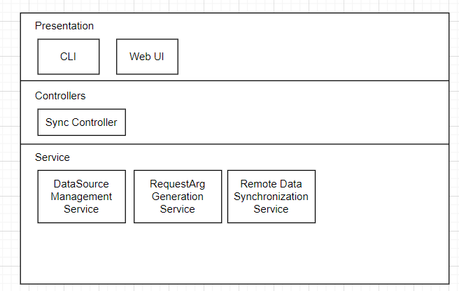

# Data Sync Tool

Data sync tool aims at providing a convenient way of managing and syncing remote data sources like Tushare and Quandl. This tool allows you to create a local copy of the remote data source, validating the quality of the data, and manage the local storage of the data fetched from remote data sources.

核心：远程数据源的取、验、存

## Features

1. Convenient Data Source Management
   1. You can add new data source by providing the url to its documentation page. This tool will try to figure out the metadata by parsing the page and automatically create new data source.
   2. You can decide whether enabling synchronization for each data set
   3. You can preview the data of the data source
   4. Your localized data will always be in sync with the remote, even if they updated the schema
   5. This tool will ensure the quality of the localized data. If there is anything wrong or missing, you will be notified.
2. Automatic Synchronization
   1. Once you configured the data source, this tool will make sure the data are in sync
   2. The process of synchronization is highly parallelized up to the limit of the remote data source.
3. Local storage configuration
   1. You can decide where to store the data.
   2. You can even store data in different format and to different location. You can store it in the filesystem, a database, object storage. You don't even have to store it on your local machine. It can be elsewhere like your cloud server.

## Architecture

This tool generally follows the DDD design pattern and emphasizes modular decoupling. It has four layers: presentation, services, entities, and infrastructure. Presentation layer is responsible for user interactions. In this layer, the tool has implemented a cli interface and web interface. Users use either way to interact with this tool. Services contain the main business logic of this tool. Entities encapsulate the core concepts and models of this tool. Infrastructure layer contains modules for external data transfer and data storage.

## Detailed Design

从controller层面看，数据同步有以下步骤

1. 生成动态请求参数
2. 获取所有未同步的数据源
3. 将动态请求参数传递给同步模块

如果使用之前tsync的设计，那么步骤1、3之间可以用一个公共的数据结构通信

数据流向是1+2 -> 3

这种设计下，数据源只负责管理其所属的metadata，不负责同步和存储工作

同步逻辑由专门的模块完成，可以抽象成一个domain

那么在这个视角下，整个应用可以拆分成3个domain

1. DataSource, 负责描述和管理远程数据源的元数据、本地存储参数和请求参数
2. RequestArgTemplate, 负责存储、管理和生成同步所需的参数
3. RemoteDataSynchronization，负责管理和控制远程数据源的同步

为了支持灵活的请求参数生成，在内建一部分默认模板的基础上，开放出自定义模板功能给用户。

模块功能上就有CRUD、生成两大块

Design decision: 用外部包还是自己实现TemplateEngine?

参数生成的目标：根据模板和提供的数据生成JSON数据

整个同步的流程为

1. query for all unsynced data source
2. for each unsynced data source

   1. generate request args using data source's metadata
   2. synchronize the local data source using information from data source and generated argument
      1. create synchronization task batches using information from data source and generated argument
      2. while not all tasks are completed
         1. pick all available tasks from the wait list using the max concurrent task settings
         2. if no tasks available, poll for each second to see if any task is ready
         3. otherwise, make tasks into http requests, and send the request concurrently using the http client
         4. on request success,
            1. if the request contains no data, discard the request result
            2. otherwise, send the requested data to the message queue for the downstream service to process
3. on request failure,
4. if the server says you requested too frequently,
5. if the wait time is larger than the maximum wait time, then there is no point of waiting, cancel the rest of the task, report an error, and stores a checkpoint
6. otherwise, reset the clock of the task to its cool downtime, and put it back to the wait list to cool down
7. if the server says your day limit is exceeded,
8. report an error,
9. save the checkpoint
10. cancel the rest of the task
11. if the remote says the argument is wrong,
12. report an error
13. drop the task
14. if request time out,
15. report an error
16. retry until max attempt exceeded
17. save the checkpoint
18. cancel synchronization
19. on other error
20. report error
21. save the checkpoint
22. cancel synchronization
