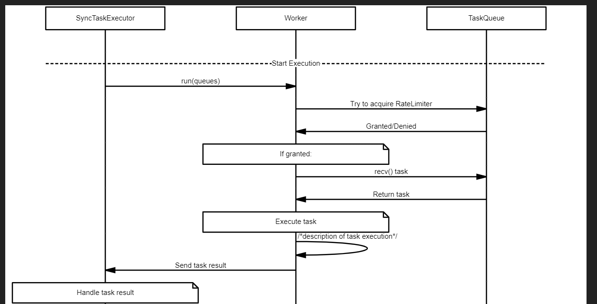

# Sync Task Executor

`SyncTaskExecutor` is the central coordination entity that manages the execution of synchronization tasks. It consists of a pool of `Worker` objects, each responsible for executing tasks. The execution of tasks is monitored by `SyncTaskExecutor` using message passing via tokio channels.

### Entities:

- `Worker`: Responsible for executing tasks. Each worker communicates with the `SyncTaskExecutor` by sending the result of each task execution. The worker can handle multiple tasks concurrently. Each worker is capable of executing any task that is given to it, though the tasks are chosen based on a scheduling strategy.
- `TaskQueue`: A queue dedicated to storing sync tasks for a particular dataset. It is bound to a `RateLimiter` that helps maintain the limits imposed by the data vendor.

### Value Objects:

- `Task`: The atomic unit of work that a worker executes.

### Major Components:

- `SyncTaskExecutor`: Responsible for coordinating the workers and monitoring their progress, handling their results, and reacting to errors.
- `RateLimiter`: A mechanism to prevent exceeding the rate limit imposed by data vendors.

The `SyncTaskExecutor` starts workers, each of which tries to execute tasks by receiving them from the `DatasetQueue`, respecting the rate limit. When the execution is done, the `Worker` sends the result back to the `SyncTaskExecutor`, which then handles the result. It checks for errors, and if any are found, it decides if the task needs to be retried or not based on the remaining retry count of the task.

The entire design is intended to be asynchronous, built around the `async/await` feature of Rust and the async runtime provided by Tokio, making the best use of system resources and providing high throughput.

## Rough Idea of Task Scheduling

Let me propose a new design for SyncTaskExecutor. It should orchestrate data synchronization and gracefully handling errors. 

Before giving you the design, let me describe some cases where tasks could fail.

In our usecases, tasks could fail due to:

* Network error
* Rate limit exceeded
* Invalid request
* User sends a control c signal
* User cancels the task
* Other unrecoverable error

Let me describe the requirement and the design of SyncTaskExecutor.

---


The SyncTaskExecutor has two components: WorkerPool and TaskQueueManager.

* The WorkerPool is a VecDeque of type bounded by trait SyncWorker.
  * For each worker in the worker pool, it runs a spinning loop while the TaskQueueManager still has unfinished tasks.
  * A worker will try to get tasks, watch for cancel command, keyboard interrupt, cancel task command, invalid requests error, and request rate exceed error
    * A worker will try to send a checkpoint command to the broadcast channel when encountered an unrecoverable error or keyboard interrupt.
  * It will try to query TaskQueueManager to get a task to run. A worker will get an `Option <SyncTask>` . While the task is resolved to None, it will wait until it gets a task. When the worker gets a task, it will try to run it, and if the task is successful, it will send the task to the result channel. Otherwise, it will send it back to the TaskQueueManager until the the number of retries is run out. On each status update, it will create and send a message struct through a tokio::sync::broadcast channel.
    * The body of this message consists of these variants:
      * StatusReport:
        * containing dataset id, task id, status, and message to the status reporting channel (which is a watch channel).
      * Checkpoint
        * containing dataset id, a vector of finished task id, a vector of unfinished task id
        * sent on DailyLimitExceedError,
* TaskQueueManager holds a hashmap of <DatasetId, TaskQueue>.
  * It is responsible for managing task queues.
  * It can get and add tasks.
  * Each TaskQueue may contain a RateLimiter.
  * When TaskQueueManager tries to get a task of a TaskQueue, it will try to get a task with round robin style. To ensure fairness, it will remember which task queue was polled and skip it on next query.
  * When a TaskQueue is asked to return a task, it will check whether it has a RateLimiter.
    * If it has a RateLimiter, the RateLimiter will return an enum to tell whether the limit is exceeded. If not, a task is allowed to be popped off the queue. Otherwise, the queue will return nothing.
      * **If the day limit is exceeded**, all remaining tasks in the current queue must be cancelled. This case will lead to a unfinished sync plan. The worker will report this status and let SyncPlan set a checkpoint to where to start on the next sync iteration.
    * Otherwise it just pops a task of the queue
    * The TaskQueueManager will deduct the number of remain tasks by 1 in this case
  * The TaskQueueManager counts the number of tasks left in all queues.

Let me describe the high level design of RateLimiter.

---


RateLimiter is a trait contains a method called can_proceed. It returns a message enum called RateLimitStatus containing 4 variants: Ok(remaining_count), RequestPerMinuteExceeded, RequestPerDayExceed, CountDownUnfinished(remaining_second)

The RateLimiter will disallow sending task on these conditions:

* Number of requests per day is exceeded.
* Number of requests per minute is exceeded
* Freeze countdown not finished
  * A freeze count down is set to the time provided by an error message from A remote data vendor. The rate limiter uses an ErrorMessageAnalyzer to understand the error message.

For each request send to rate limiter, it will deduct the available request by 1 if the limit is not exceeded. Otherwise, it will start a count down of 60 seconds unless the daily limit is exceeded. If the remote says the daily limit is exceeded, the rate limiter will return RequestPerDayExceed variant of the message enum

Let me describe the high level design of ErrorMessageAnalyzer

---


ErrorMessageAnalyzer is a utility service that uses some rules or patterns from the database to parse error messages returned by remote web service. It uses these rules to parse error message string into a enum that covers common web request errors. In our usecase, the data vendor may return errors like RateLimitExceedError, FieldsNotFoundError, InvalidTokenError, MaxDailyRequestReachedError. Other uncaptured error will be converted into GeneralWebRequestError(message). The returned error message will be matched against rules of type regular expressions. In the database, these rules will be stored as strings. The error message may be in English or Chinese.


## Updated Design

I would like to update the design of SyncTaskExecutor. A SyncTaskExecutor has two components:

1. a pool of SyncWorkers. They can be different types of workers that implemented SyncWorker trait. I will give you details about it.
2. a hashmap of TaskQueues. The key of TaskQueue is the dataset id, and the value is a TaskQueue holding many SyncTasks. I also want to move RateLimiter as an optional member of TaskQueue. It will make TaskQueue optionally rate limited.

SyncTaskExecutor has these apis:

1. `fn add_tasks(&mut self, sync_tasks: Vec<SyncTask>) -> Result<Self, Box<dyn Error>>` Add tasks to queue. Calls TaskQueue's `add_task`.
2. `fn apply_limit(&mut self, rate_limit: RateQuota, dataset_id: UUID) -> Result<Self, Box<dyn Error>>` Apply rate limit to task queue
3. `async run(&mut self)` Start running the executor
4. `async fn cancel(&mut self, dataset_ids: Optional<&[UUID]>)`
   Cancel tasks. If dataset_ids are not provided, cancel all tasks.
5. `async fn report_progress(&self) -> Result <ExecutionProgress, Box<dyn Error>>` Report execution progress, including number of completed tasks, total number of tasks, total number of pending tasks, and total number of failed tasks. The progress object should also include a hashmap of dataset id and a tuple struct containing number of completed tasks, total number of tasks, total number of pending tasks, and total number of failed tasks.

TaskQueue has these apis:

1. `fn add_tasks(&mut self, sync_tasks: Vec<SyncTask>) -> Result<Self, Box<dyn Error>>`
2. `fn apply_limit(&mut self, rate_limit: RateQuota, dataset_id: UUID) -> Result<Self, Box<dyn Error>>` Calls RateLimiter's apply_limit
3. `fn is_empty(&self) -> bool`
4. fn view_task(&self) -> Option<&SyncTask> View the head of the task queue
5. `fn get_task(&self) -> Result <Option<&mut SyncTask>, RateLimitExceed>` Try to get a task off the queue. If the task is rate limited, and the limit is exceeded, then throws a RateLimitExceed exception
6. `fn push_back(&self, sync_task: SyncTask)` push a sync back to the queue

RateLimiter has these apis

1. `apply_limit(&mut self, rate_limit: RateQuota)`
2. `can_proceed(&mut self) -> Result<(), RateLimitExceed>`

Worker has these apis:

1. `async fn handle(&self, sync_task: &mut SyncTask) -> Result<&mut SyncTask, Box<dyn Error>>`

Pseudocode

```
interface SyncWorker {
    async fn handle(&self, task: SyncTask) -> Result<serde::json::Value, Box<dyn Error>>
}

interface RateLimiter {
    async
}

```

## Sequence



## High Level Implementation

The `SyncTaskExecutor` is essentially responsible for coordinating the workers and monitoring their progress, handling their results, and reacting to errors. To achieve these requirements, you can make use of various Rust and Tokio features, like channels for communication and sharing state, and `async`/`await` for managing concurrent tasks.

Given these additional requirements, here's a rough sketch of the updated `SyncTaskExecutor` and `Worker` implementation:

```rust
use std::collections::HashMap;
use std::time::Instant;
use tokio::sync::{Semaphore, mpsc};
use tokio::task;

// Assume Task is the type of tasks
// Let's add a retry field
struct Task {
    retries_left: u32,
    // other fields here
}

// Assume Data is the type of the fetched data
struct Data {
    // fields here
}

struct DatasetQueue {
    queue: mpsc::Receiver<Task>,
    rate_limiter: Semaphore,
    freeze_until: Option<Instant>, // new field
    // other fields as needed
}

// Worker now has an additional sender for results
struct Worker {
    id: usize,
    task: Option<task::JoinHandle<()>>,
    result_sender: mpsc::Sender<(usize, Result<Data, String>)>, // (worker_id, Result)
}

impl Worker {
    async fn run(&mut self, queues: HashMap<String, DatasetQueue>) {
        self.task = Some(tokio::spawn(async move {
            loop {
                // round-robin or other scheduling algorithm
                for dataset_queue in queues.values() {
                    if !dataset_queue.is_frozen() && dataset_queue.rate_limiter.try_acquire().is_ok() {
                        if let Some(mut task) = dataset_queue.queue.recv().await {
                            // execute task
                            let result = /* task execution here */;
                            self.result_sender.send((self.id, result)).await.unwrap();
                            if result.is_err() && task.retries_left > 0 {
                                task.retries_left -= 1;
                                // enqueue the task back for a retry
                                dataset_queue.queue.send(task).await.unwrap();
                            }
                        }
                    }
                }
            }
        }));
    }
}

struct SyncTaskExecutor {
    workers: Vec<Worker>,
    result_receiver: mpsc::Receiver<(usize, Result<Data, String>)>,
    // other fields as needed
}

impl SyncTaskExecutor {
    async fn start(&mut self) {
        for worker in &mut self.workers {
            worker.run(/* pass the queues */).await;
        }

        while let Some((worker_id, result)) = self.result_receiver.recv().await {
            match result {
                Ok(data) => {
                    // handle the successful case
                    // send data to the message queue
                },
                Err(error) => {
                    // handle the error case
                    // report the error
                }
            }
        }
    }
}
```

The `SyncTaskExecutor` now has a receiver for the results. Each worker has a sender and sends the result of each task to the `SyncTaskExecutor`. The `SyncTaskExecutor` handles these results in its `start` method.

Please note that this is just a simple design, and real implementation would need more considerations and detailed design according to the specific requirements of your project.s
